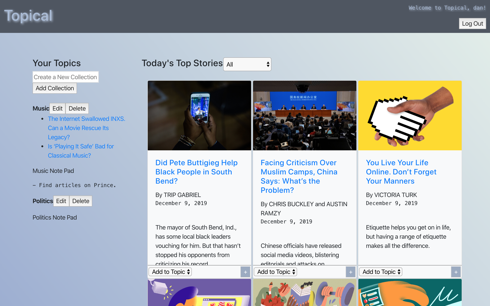
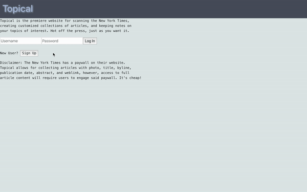
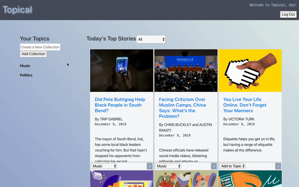
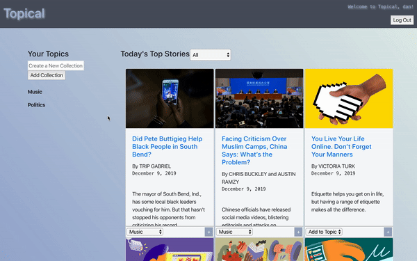

App for scanning the New York Times and creating collections of articles based on specific 
topics of interest (beta). It is a project application done for module 4 of Flatiron School. 
This project has several unfinsihed features and bugs that will be worked out in the future.
These include to-dos like: 
  - repair functionality of React Router
  - add custom validation error messages
  - enhance styling

## Authors
  - Lisa LaRochelle [lilaro](https://github.com/lilaro)
  - Dan Romans [dangrammer](https://github.com/dangrammer)

## Backend Repository
  - [Topical API](https://github.com/dangrammer/topical-backend)

## Languages/Libraries:

  - HTML5 (JSX)
  - CSS3
  - ES6 JavaScript
  - React ^16.11.0 
  - React-Dom ^16.11.0 
  - React-Router ^5.1.2 
  - React-Router-Dom ^5.1.2 
  - React-Bootstrap ^1.0.0-beta.14
  - React-Scripts ^3.2.0 
  - Bootstrap ^4.3.1

## Live Demo
  Link to walkthrough video with narration:
   
    

## Screenshots

  Login/Signup
   
  

  Filter Articles
   
  

  Add, Edit, and Delete Collection
   
  

  Add and Edit Articles and Notes
   
  

## How To Install and Run 

  1. install and run [Topical backend API](https://github.com/dangrammer/topical-backend)
  2. fork (optional) then clone or download this repository to local machine
  3. use text editor and/or terminal to navigate into `topical-frontend` directory
  4. run `npm install` (or `npm i`) in terminal to install necessary dependencies
  5. run `npm start` in terminal to launch the app in browser

  *_Note: If backend server is already running, it will be running on http://localhost:3000/. After 
  running_ `npm start`_, follow prompt and enter_ `y` _in terminal to run frontend on alternate port._

